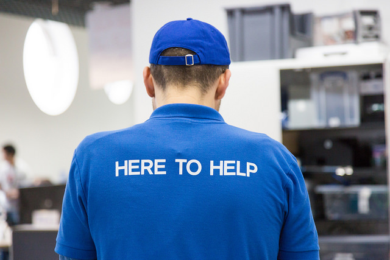

# Mozfest 2016 - Science!

## So you're facilitating a session at Mozfest...

We're so happy you can join us this year to share your latest idea, project, and/or skills with the Mozfest community! 

If you've been selected as a facilitator, you might have some questions like, "what is the difference between an 'hands on' and a 'learning lab' or how does a 'fireside chat' differ from a 'demo'?" Since Mozfest is unlike any (un)conference you've probably ever been to, we at Mozilla Science have put together this little README on what you as a facilitator might expect to do while running your session depending on the session format.

***
### Hands On

***About***

In a **Hands On** session, you will be teaching your participants a new skill, technology, a new way of seeing the world, and perhaps all of those things together. As a result these sessions are very *hands on* as you step your participants through the thing you're interested in teaching. 

***Timing***

2 hours

***Example***

A Github Training workshop woudld be a good example of a Hands On in which participants would learn the basics of Github and be stepped through the process of making and managing their own projects using Github. In the days leading up to your session you might:

* prepare some slides and/or a github repository with all of the materials you want to share with your participants

In the 2 hours of your session, you might: 

* start with a introduction on who you are, 
* let participants introduce themselves to their neighbors (depending on the size of the group), and then 
* present on why the participants might want to learn the thing they've gathered for, then
* get into the *hands on* learning materials by walking through an exercise (or series of exercises).

***
### Learning Lab

***About***

In a **learning lab** session, you will be teaching your participants a new skill, technology, a new way of seeing the world, and perhaps all of those things together. You might also be interested to work together with your participants on brainstorming on an idea and/or fielding feedback on a project. Learning labs might be more focused than a hands on session due to the time contraints (1 hour) yet still allow the participants to get a good feeling for a new topic, idea, etc.

***Timing***

1 hour

***Example***

An example of a learning lab might be a session about gathering ideas about how to teach people about the principles, the benefits, the misunderstandings, etc of "open science". In the 1 hour session you might:

* do a quick introduction on who you are
* ask your participants to write their ideas about what they think the principles, benefits, and misunderstandings about "open science" are,
* organize the sticky notes into categories on the table in which you're working,
* document and synthesize the learnings from the group
* give your participants a takeaway with how they can take that knowledge forward.

***
### Sprint

***About***

A *sprint* may be a concentrated burst of effort that is dedicated to developing a project. This may be in the form of fielding contributions, onboarding new contributors, adding new features, or brainstorming and milestoning the next steps for a project. A sprint is also a great way to start a project that has been brewing in your mind and you're looking for an opportunity to start. Often times a sprint will attract people who are already interested in your topic and/or already familiar with your project and want to contribute in some way.

If you'd like your sprint project to be featured on [Network Pulse](http://mzl.la/pulse) at MozFest, be sure to complete [Open Project Training](https://acabunoc.github.io/mozfest-open-projects-2016/) before the festival!

***Timing***

tbd

***Example***

One example of a sprint might be a 2-3 hour period in which contributors come together to add a new feature to your a scientific plotting interface you developed to help non-programmers make beautiful plots on the web. In this session you might spend the time:

* adding a new type of plot
* onboard new developers into your project through walking them through your codebase or styleguide

Another example of a sprint might be a 2-3 hour period in which you ask your participants to contribute a page to a "zine" which helps to explain gender inequality in the university system. In this session, you might:

* get participants to contribute a page to the zine based on a topic they think addresses a particular aspect of gender inquality using magazine and newspaper cutouts, tape, and glue,
* and bind the zine together, scan it, and share it with the group.

***
### Demo

***About***

A *demo* is a way of showing off a project to a wide audience, getting people interested in what you've been up to, and fielding feedback and making new connections. Demos are a great way to inspire and be inspired by who you meet and dazzle with your great work. Your demo might also be a way to give people and overview of a tool you've developed and maybe even get new users of your tools and/or way of thinking.

***Timing***

15 min

***Example***

An example of a demo might be to show people a new sensor that you developed to measure meteorological variables. In your demo you might show how the sensor works and the best practices for making measurements. 

Another example of a demo might be to show people the new web app you built that helps people to gain access to hard-to-access government information. 

***
### Fireside Chat

***About***

A *fireside chat* is a way of getting people together to discuss a topic of interest. During the chat you might get a round table together to explore the latest news from a subject or describe your personal experiences with a topic. 

***Timing***

30 min

***Example***

An example of a fireside chat might be to describe your experiences covering human rights violations and to engage your participants to share out their experiences addressing those types of violations with various technological or policy based initiatives.
